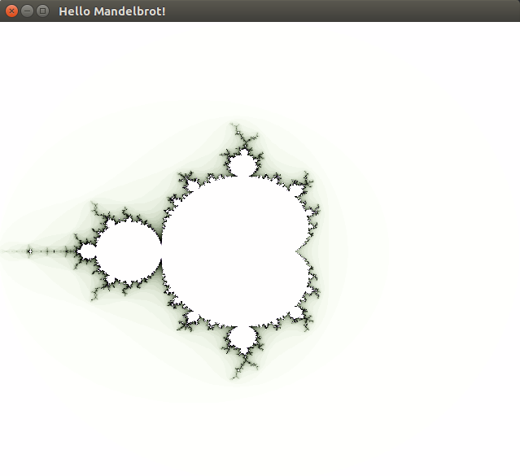

## Implementation of the "Composing Fractals" paper by Mark P Jones

Paper [here](http://web.cecs.pdx.edu/~mpj/pubs/composing-fractals.pdf)

### Example

#### Using OpenGL (GLUT)

Just type `./fractals`



#### Character rendering

```
> figure1
'''''''''''''''''''''''''''""""""""""""""""""""""""""""""""""""""""""''''''
'''''''''''''''''''''''""""""""""""""""""""""""""""""""""""""""""""""""''''
''''''''''''''''''''""""""""""""""""""""""""""""""""""""""""""""""""""""""'
'''''''''''''''''""""""""""""""""""""""""""""~~~~~~~~~~~~~"""""""""""""""""
''''''''''''''"""""""""""""""""""""""""""~~~~~~~~~~:~~~~~~~~~""""""""""""""
''''''''''''"""""""""""""""""""""""""~~~~~~~~~~:::/o;;:::~~~~~~~"""""""""""
''''''''''"""""""""""""""""""""""~~~~~~~~~~~~::::;o?/-o-;::~~~~~~~"""""""""
''''''''""""""""""""""""""""""~~~~~~~~~~~~:::::;;oo!?{<!o;:::~~~~~~~"""""""
''''''""""""""""""""""""""~~~~~~~~~~~~~::::::;;;o!?/$$#!-o;::::~~~~~~~"""""
''''"""""""""""""""""""~~~~~~~~~~~~~::::::;;;;oo!/$$$$$8X-o;;:::::~~~~~""""
''""""""""""""""""""~~~~~~~~~~~~~::::::;;oooo--!|<$$$$$$?!-oo;;;;;::~~~~"""
'""""""""""""""""~~~~~~~~~~~~::::::::;;o!O$<??${$$8$$$$$$$>$|--!/!;::~~~~""
"""""""""""""""~~~~~~~~~::::::::::;;;;o-!<$$$$$$$$$$$$$$$$$$$X$$$$o;::~~~~"
"""""""""""""~~~~~~~~::::::;;;;;;;;;oo-|/X$$$$$$$$$$$$$$$$$$$$$${!o;::~~~~~
"""""""""""~~~~~~~~:::;o?-oooooooooo-!|=$$$$$$$$$$$$$$$$$$$$$$$$$|-o;::~~~~
"""""""""~~~~~~~~::::;;o//|?!|^|!!!!!|$$$$$$$$$$$$$$$$$$$$$$$$$$$$$@;::~~~~
"""""""~~~~~~~::::::;;o-!?X$$%%$O$$??<$$$$$$$$$$$$$$$$$$$$$$$$$$$$|o;::~~~~
"""""~~~~~~::::::;;;oo-!$X$$$$$$$$$$+{$$$$$$$$$$$$$$$$$$$$$$$$$$$O/o;::~~~~
""""~~~~::::;;;;;oo-!%/>>$$$$$$$$$$$$$$$$$$$$$$$$$$$$$$$$$$$$$$$$<-;;::~~~~
""""~~::;;o-/--!!!!>/{$$$$$$$$$$$$$$$$$$$$$$$$$$$$$$$$$$$$$$$$$$|-o;:::~~~~
""""~~::;;o-/--!!!!>/{$$$$$$$$$$$$$$$$$$$$$$$$$$$$$$$$$$$$$$$$$$|-o;:::~~~~
""""~~~~::::;;;;;oo-!%/>>$$$$$$$$$$$$$$$$$$$$$$$$$$$$$$$$$$$$$$$$<-;;::~~~~
"""""~~~~~~::::::;;;oo-!$X$$$$$$$$$$+{$$$$$$$$$$$$$$$$$$$$$$$$$$$O/o;::~~~~
"""""""~~~~~~~::::::;;o-!?X$$%%$O$$??<$$$$$$$$$$$$$$$$$$$$$$$$$$$$|o;::~~~~
"""""""""~~~~~~~~::::;;o//|?!|^|!!!!!|$$$$$$$$$$$$$$$$$$$$$$$$$$$$$@;::~~~~
"""""""""""~~~~~~~~:::;o?-oooooooooo-!|=$$$$$$$$$$$$$$$$$$$$$$$$$|-o;::~~~~
"""""""""""""~~~~~~~~::::::;;;;;;;;;oo-|/X$$$$$$$$$$$$$$$$$$$$$${!o;::~~~~~
"""""""""""""""~~~~~~~~~::::::::::;;;;o-!<$$$$$$$$$$$$$$$$$$$X$$$$o;::~~~~"
'""""""""""""""""~~~~~~~~~~~~::::::::;;o!O$<??${$$8$$$$$$$>$|--!/!;::~~~~""
''""""""""""""""""""~~~~~~~~~~~~~::::::;;oooo--!|<$$$$$$?!-oo;;;;;::~~~~"""
''''"""""""""""""""""""~~~~~~~~~~~~~::::::;;;;oo!/$$$$$8X-o;;:::::~~~~~""""
''''''""""""""""""""""""""~~~~~~~~~~~~~::::::;;;o!?/$$#!-o;::::~~~~~~~"""""
''''''''""""""""""""""""""""""~~~~~~~~~~~~:::::;;oo!?{<!o;:::~~~~~~~"""""""
''''''''''"""""""""""""""""""""""~~~~~~~~~~~~::::;o?/-o-;::~~~~~~~"""""""""
''''''''''''"""""""""""""""""""""""""~~~~~~~~~~:::/o;;:::~~~~~~~"""""""""""
''''''''''''''"""""""""""""""""""""""""""~~~~~~~~~~:~~~~~~~~~""""""""""""""
'''''''''''''''''""""""""""""""""""""""""""""~~~~~~~~~~~~~"""""""""""""""""
''''''''''''''''''''""""""""""""""""""""""""""""""""""""""""""""""""""""""'
'''''''''''''''''''''''""""""""""""""""""""""""""""""""""""""""""""""""''''
'''''''''''''''''''''''''''""""""""""""""""""""""""""""""""""""""""""''''''
>
```
